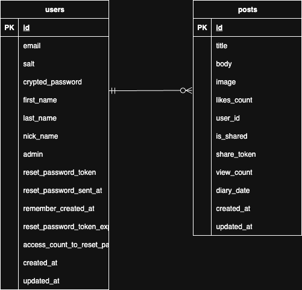

# おつかれ自分。ふぅ日記
!(images/huu.png)

## サービス概要
日々の疲れを感じる人に、安心して感情を吐き出せるプライベート空間を提供し、自動いいね機能による肯定体験で自己肯定感を高めるクローズド日記アプリです。
「ふぅ、、」と一息ついた1日の終わりの時間にあなたの頑張りを振り返ってみませんか？

## ターゲット層
- 20代〜30代の社会人
- 日記を書く習慣がないが、心の整理をしたい人
- 日々の疲れを吐き出す場所が欲しいが、プライベートな感情は人に見られたくない人
- 自己肯定感を高めたいと感じている人

## サービスへの思い
SNSで他人と比較して落ち込んだり、「いいね」の数で一喜一憂したり、、、
現代を生きる多くの人が、そんな疲れを感じているのではないでしょうか。

でも本当は、毎日仕事に行くことも、家事をすることも、人に優しくすることも、全部立派な「頑張り」なんです。
そんな日常の小さな頑張りを、自分自身がきちんと認めてあげられる場所があったらいいなと思いました。

日記は心の整理に効果的と言われています。
WEBアプリに落とし込むことで、手軽にセルフケアをし、少しでも自分のことを好きになれれればいいなという思いを込めてこのサービスを開発しました。

## ユーザビリティへのこだわり
- **自己肯定感を高める設計**: 投稿に応じて自動でいいねを付与。文字数や感情ワードに応じて増減し、ささやかに肯定してくれます。(感情分析ワード例: 「楽しい」「疲れた」)
- **安心できるプライベート日記**: 管理者も日記内容は閲覧不可。ユーザーが選択した投稿のみシェア可能。
- **日記習慣をサポート**: 書き方のヒント表示で、日記を書いたことがない人でも気軽に始められる
- **親しみやすいUI**: カードを丸く、淡い緑を基調としたデザインで心理的負担を軽減
- **ログイン保持**: 中期間のログイン省略で毎回の入力を減らす(sorceryのremember_me)
- **ユーザー画像の永続化**: 個性を活かせるアイコン画像を永続保存(Cloudinary連携)

## 使用方法
1. アカウント登録・ログイン
2. 今日の気持ちを日記に書く
3. 自動いいねでささやかに自己肯定感UP
4. 必要に応じてXでシェア

## 今後の追加予定機能
- カレンダー機能(過去の記録をわかりやすく管理)
- お気に入り機能(大切な日記をブックマーク)
- 検索機能(キーワードで日記検索)
- 連続投稿機能(習慣化をサポート)

## 開発背景
プログラミング学習3ヶ月弱での初めてのWebアプリとして開発。

## 技術スタック
- ruby: 3.3.6
- Rails: 8.0.2
- PostgreSQL: 17.5 (Debian 17.5-1.pgdg120+1)
- Node.js: 20.19.4
- Yarn: 1.22.22

## ER図

＊ActiveStorage(active_storage_blobs,active_storage_attachments)は省略しています

